# Linux服务器访问外部网站教程

> **2025.12.29 更新**
>
> 上一版的服务器内命令行科学上网办法仍然有效（即之前的 Clash for Linux 仍能继续使用），但是由于该软件使用的 Clash 内核在 23 年因不可抗力停止更新维护，导致现阶段较新的代理协议不受支持。
>
> 此外，由于许多代理软件较为依赖 Linux 的图形化界面，在服务器上部署不便。因此，本文提供了一个简洁的、**将本地电脑作为访问外部网站跳板**的操作手册，希望对广大服务器用户、学术研究者有帮助。

---

## 1. For Windows

### 🛠️ 需要配备的软件
* [**MobaXterm**](https://mobaxterm.mobatek.net/download.html)
* [**Clash Verge Rev**](https://github.com/clash-verge-rev/clash-verge-rev)

> **Ps**: 如果不想下载 MobaXterm，请参考后文的 "For Linux/MacOS" 章节。

### 🚀 操作步骤

1.  **本地代理设置**
    在本地电脑中打开 Clash Verge Rev，确保打开 **系统代理**，允许 **局域网连接**，并记下 **端口设置** 中的端口号（此处示例为 `7897`，后面会用到）。
    
    

2.  **配置 MobaXterm 隧道**
    在本地电脑中打开 MobaXterm，点击工具栏上的 **Tunneling**。
    
    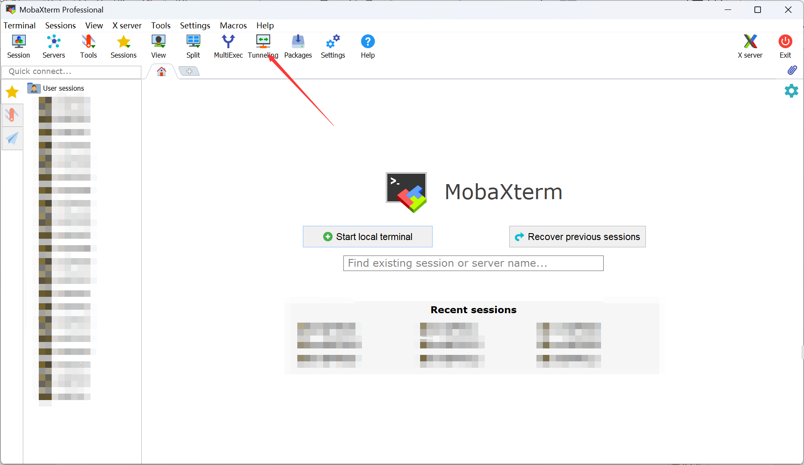

3.  **新建 SSH 隧道**
    在弹出的窗口中，点击左下角的 **New SSH tunnel**。
    
    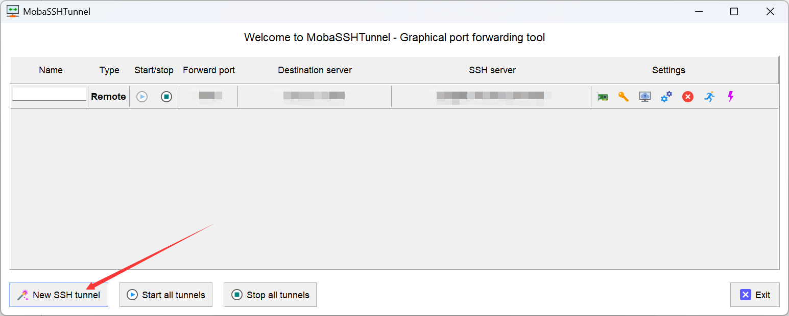

4.  **配置端口转发**
    选择上方中间的 **Remote port forwarding** 选项。请参照下图填写信息（将本地的 `7897` 端口转发到服务器），填写完毕后点击 **Save** 保存。
    
    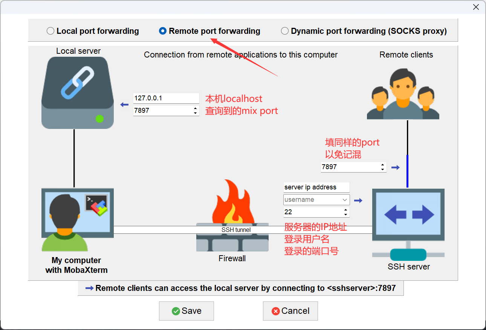
    * **Local server**: 填写本机 `localhost` 和查询到的端口 `7897`。
    * **Remote server**: 填写同样的端口 `7897`（以免记混）。
    * **SSH server**: 填写服务器 IP、用户名和 SSH 端口（通常为 22）。

5.  **启动隧道**
    保存后，列表中会新增一行配置。点击该行右侧的 **Start** (播放键) 图标。
    
    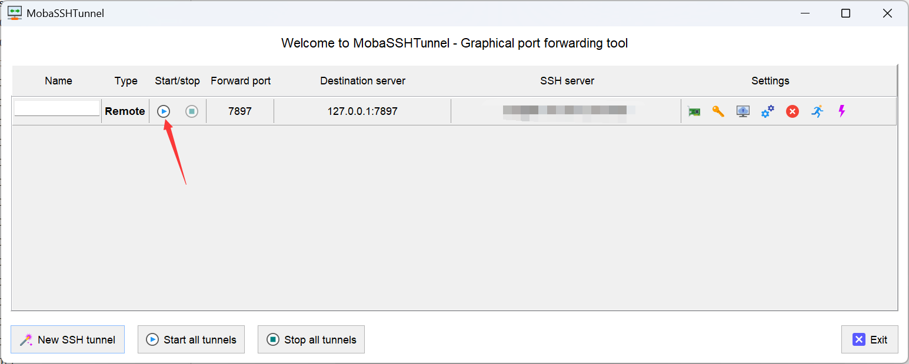

6.  **测试连接（未开启代理时）**
    登录服务器，尝试访问 Hugging Face，此时通常是无法连接的。
    ```bash
    curl -vI https://huggingface.co
    # 结果：Connection failed / Network is unreachable
    ```

     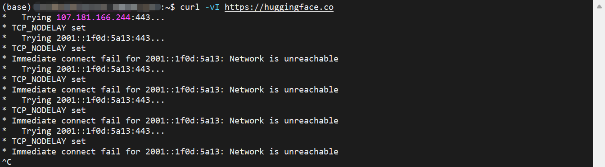

7.  **开启终端代理并验证**
    在服务器终端输入以下命令，将 HTTP/HTTPS 流量指向刚才配置的转发端口（`7897`）：
    ```bash
    export http_proxy=http://127.0.0.1:7897
    export https_proxy=http://127.0.0.1:7897
    ```
    再次尝试访问，即可成功！
    ```bash
    curl -vI https://huggingface.co
    # 结果：HTTP/1.1 200 Connection established
    ```
     

---

## 2. For Linux/MacOS

### 🛠️ 需要配备的软件
* [**Clash Verge Rev**](https://github.com/clash-verge-rev/clash-verge-rev)

### 🚀 操作步骤

1.  **本地代理设置**
    同样需要在本地电脑打开 Clash Verge Rev，开启 **系统代理** 和 **局域网连接**，确认端口号（例如 `7897`）。 

    

2.  **SSH 远程转发连接**
    打开本地终端，使用 `ssh -R` 命令连接服务器。这会将服务器的 `7897` 端口流量转发回本地的 `7897` 端口。

    ```bash
    # 语法格式：ssh -R 远程端口:127.0.0.1:本地端口 用户名@服务器IP -p SSH端口
    ssh -R 7897:127.0.0.1:7897 username@IP -p 22
    ```

3.  **开启代理**
    连接成功后，在服务器终端执行 export 命令：
    ```bash
    export http_proxy=http://127.0.0.1:7897
    export https_proxy=http://127.0.0.1:7897
    ```
    
    测试访问即可成功。
    
    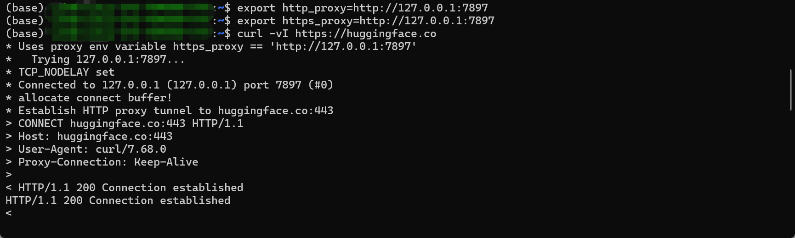
    

### ⚠️ 注意事项
* **持久化设置**：`export` 命令仅在当前终端窗口生效。
    * **方案一**：写入 `~/.bashrc`（对所有会话生效，不推荐，除非你一直开着隧道）。
    * **方案二（推荐）**：使用 `tmux` 或 `screen` 新建一个专用窗口，只在该窗口内执行 export。需要下载模型或 pip 安装时，就来这个窗口操作。
* **多用户冲突**：如果多人同时在同一台服务器上使用此方法且都绑定到 `7897` 端口，可能会冲突。建议不使用时在 MobaXterm 中点击 **Stop** 关闭隧道。

---

> **2025.6.16 更新**
>
> 一种无需本地电脑配合，直接在 Linux 服务器通过命令行实现网络代理的方法。

### 🚀 操作步骤

1.  **上传文件**
    在服务器新建文件夹（如 `Clash`），将仓库中的 `cache.db` 和 `clash` 可执行文件放入该目录。

3.  **准备配置文件**
    * 在本地电脑打开 Clash (如 Clash for Windows)，右键点击你的配置文件 -> **Show in folder**。
    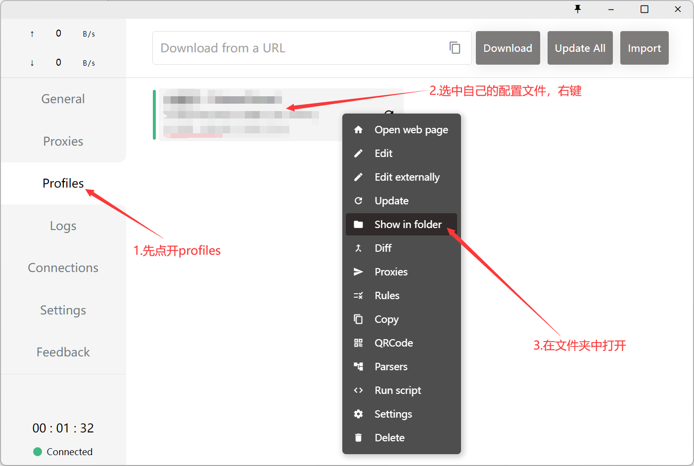
    * 找到对应的 `.yml` 文件 (通常是一串数字命名) 和 `Country.mmdb` (在.yml文件的上一级目录下)文件。
    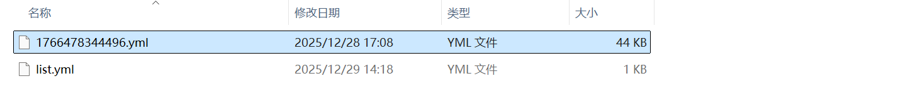
    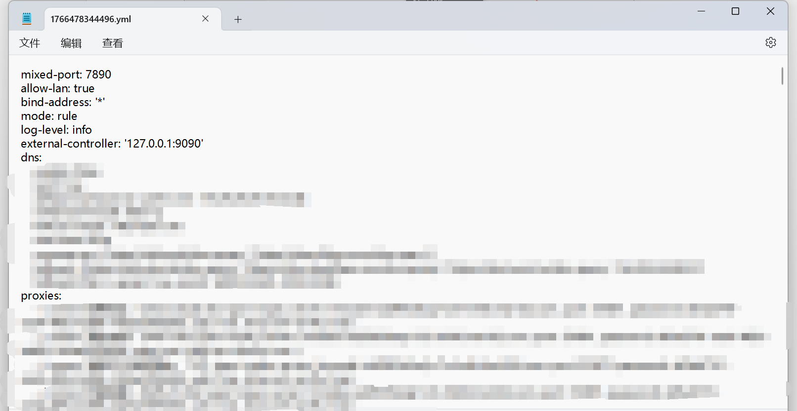
    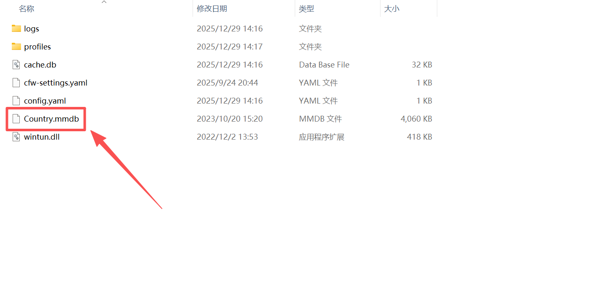
    * 将这两个文件也上传到服务器的 `Clash` 文件夹中。

4.  **重命名配置**
    将上传的 `.yml` 文件重命名为 `config.yaml`。最终文件夹结构如下：
    * `cache.db`
    * `clash`
    * `config.yaml`
    * `Country.mmdb`

5.  **运行 Clash**
    进入文件夹并赋予执行权限，然后后台运行：
    ```bash
    cd Clash/
    chmod +x clash
    ./clash -d .
    ```
    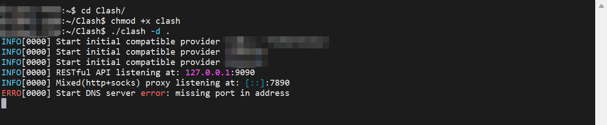

6.  **配置环境变量**
    保持 Clash 运行窗口开启（或者挂起），在需要上网的窗口输入以下命令（注意端口默认为 `7890`，具体视你的 config 而定）：
    ```bash
    export http_proxy=http://127.0.0.1:7890
    export https_proxy=http://127.0.0.1:7890
    ```
    
    测试访问：
    ```bash
    curl -vI https://huggingface.co
    ```

### ⚠️ 注意事项 
1.  **后台运行**：建议在一个单独的 `tmux` 或 `screen` 会话中运行 `./clash -d .`，保持其一直在线。
2.  **端口冲突**：如果同一台服务器有多人使用此方法，`7890` 端口会冲突。请自行修改 `config.yaml` 中的 `mixed-port` 为其他端口（如 7891, 7892 等）。
